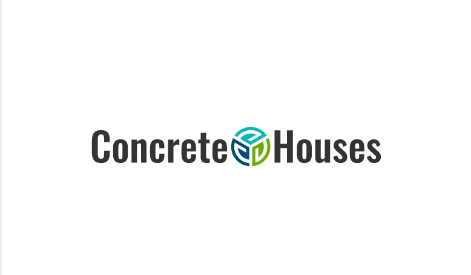
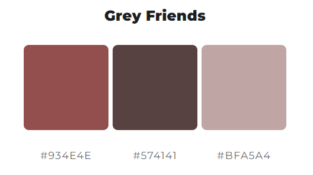

---
# *Concrete Houses*

Emphasise the benefits. Show examples. Tell people what they think about it and give people the opportunity to contact the company to provide a concrete house for themselves.

---
## User Stories
As a user, I want to understand what this site is about so I can decide if I'm interested or not.

As a user, I want to learn more about the benefits of concrete houses, including being aware of all the benefits.

As a user, I want to see how these concrete houses look like so I can choose which design I will pick.

As a user, I want to see other people's opinions so I can make an informed decision.

As a user, I want to contact the company to get more specific information.

---
## Features
+ ### Navbar

+ #### Navigation
    - Located at the top of the page.
    - The logo image is on the left side.
    - The navigation buttons are on the right side.
        * "Home" button - takes you to the main page. Selected by default.
        * "Gallery" button - takes you to a page with a library of images on the theme "Concrete Houses".
        * "Form" button - takes you to the page for filling out the form for contacting the site's consultants.
    - The opened link has an underscore.
    - Navigation buttons also have hover animation
    - In general, the top panel looks like the user's expectations.
    
    - The navigation bar is responsive:
        * On tablets and phones, the navbar moves down for compactness.
+ #### Footer page

    - Thanks to the tutorial project "Love Running" from which the form was borrowed.
---
## Design

